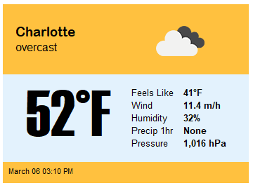
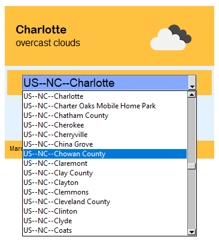

# Weather-App
 A simple weather app built with PySimpleGUI and OpenWeatherAPI

   

 ### Setup
 In order to build the application for yourself, you'll need to make sure the following libraries are installed:
 - PySimpleGUI
 - requests
 - pillow
 
 You'll also need to put a file called '`api-key.txt` in the `app data` folder that contains your OpenWeatherAPI key. You can sign up for a free API key by clicking [this link](https://home.openweathermap.org/users/sign_up).  
   
 ### Using the App
 The application opens up to a default city... whatever city you select will become the new default when you open the application again. The application is set to refresh every 15 minutes, but you can adjust this in the code.
   
If you click the **ESCAPE** key on your keyboard, the application will close.    
  

You can click the **CITY** name to pull up a combo box where you can select a different city with the US. If you want to use a different set of cities, you can change the logic in list comphrension. However, because of how this particular application is built, the 200k plus cities significantly slow down the app while trying to load, so I stuck with US cities. I'm sure there's a better way to handle this.
 
  

### Creating an executable  

If you'd like to create an executable file, I've included the `pyinstaller.spec` file as a template for you to use. If you run the `create_exe.bat` file on Windows, it will create a single-file executable that you can run on any Windows Machine.
