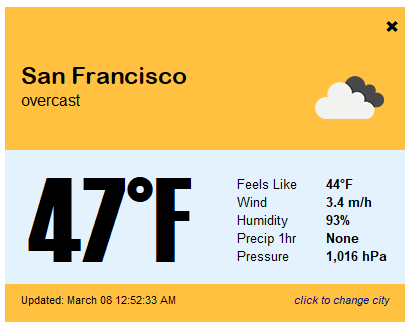
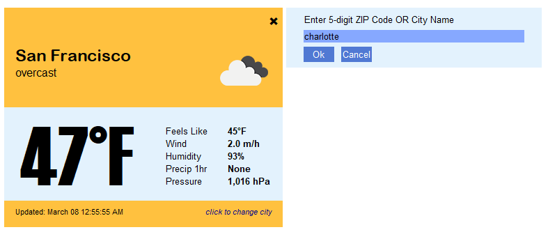

# Weather-App
 A simple weather app built with PySimpleGUI and OpenWeatherAPI.  [Try it out on Trinket!](https://trinket.io/pygame/d8d9977bad)

   

 ### Setup
 In order to build the application for yourself, you'll need to make sure the following libraries are installed:
 - [PySimpleGUI](https://pysimplegui.readthedocs.io/en/latest/)
 - [requests](https://requests.readthedocs.io/en/master/)
 
Please change the `API_KEY` in the `weather_widget.py` file to your own. You can sign up for a free API key by clicking [this link](https://home.openweathermap.org/users/sign_up).  
   
 ### Using the App
The application will try to open up with the city connected to your API address. If that's not possible, it will default to whatever data is stored in the `APP_DATA` dictionary. You can click the **X** at the top right hand corner to close the application.  
  
You can click the **click to change city** text to select a different city in the US by typing in a ZIP Code or City name in the combo box. 

The app is currently set to refresh every 5 minutes. But, you can change this in the `refresh_rate` parameter in the `main` function.  
   
  

### Creating an executable  

If you'd like to create an executable file, I've included the `pyinstaller.spec` file as a template for you to use. If you run the `create_exe.bat` file on Windows, it will create a single-file executable that you can run on any Windows Machine.
